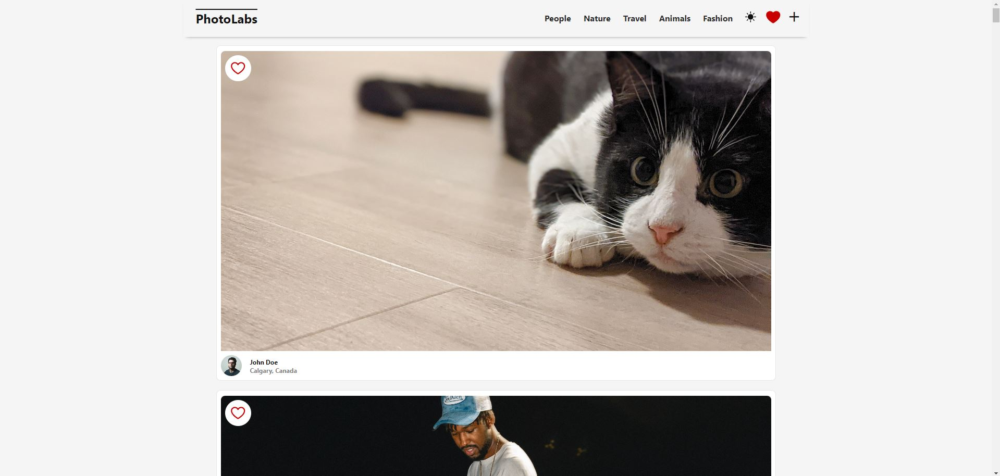
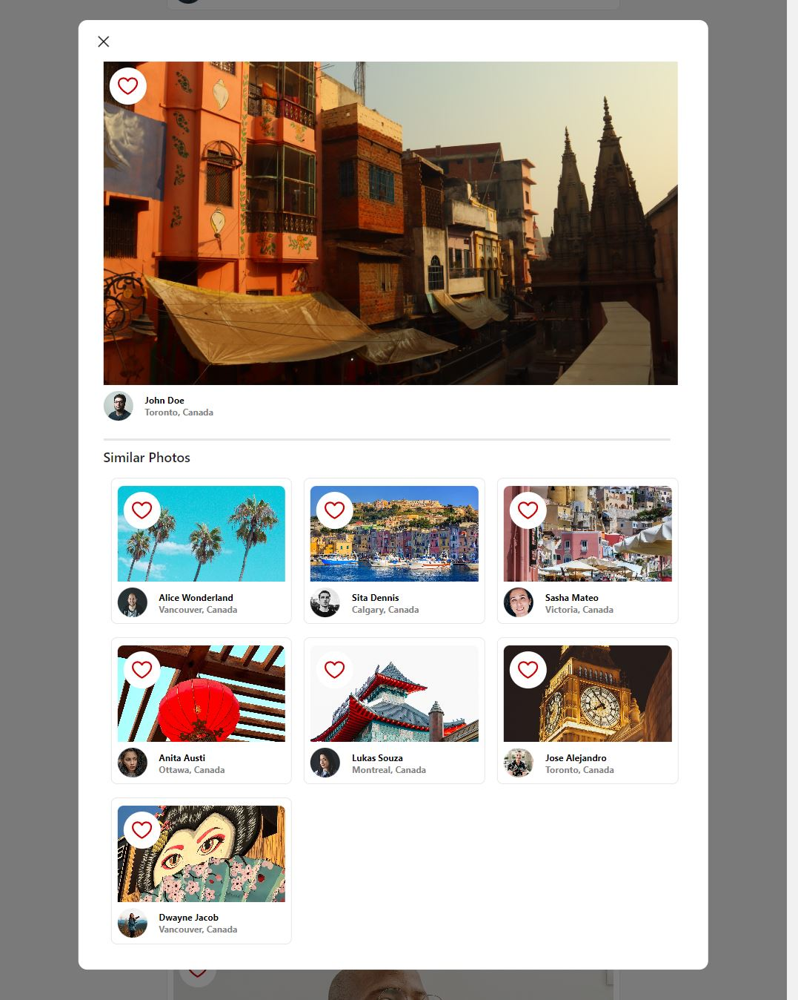

# react-photolabs
The PhotoLabs project for the Web Development React course programming. Photolabs is a single-page photo viewing app. Users can browse the collection of photos displayed from a PostgreSQL database. 



Users can like photos, select photos to view in a focused modal, filter by topic, and browse similar images.



# Photolabs

## Setup

Install dependencies with `npm install` in each respective `/frontend` and `/backend`.

## [Frontend] Running Webpack Development Server

```sh
cd frontend
npm start
```

## [Backend] Running Backend Servier

Read `backend/readme` for further setup details.


```sh
cd backend
npm start
```
